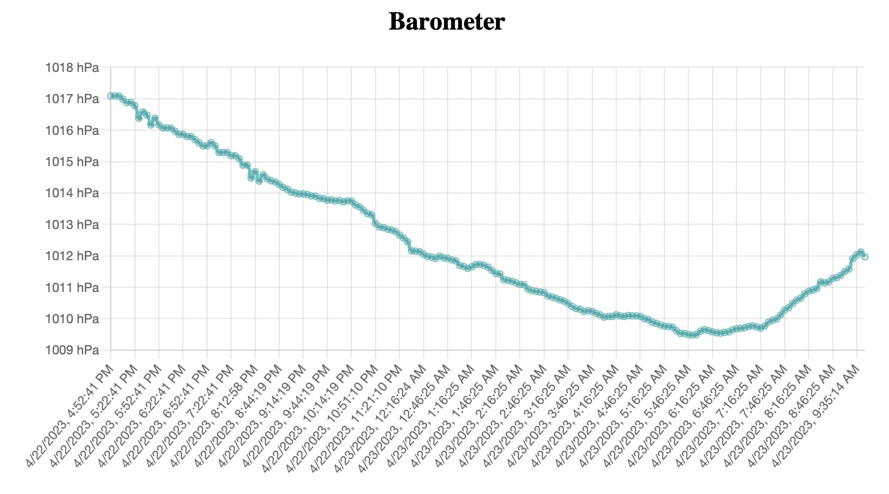

# Barometer for Signal K
Simple barometer plugin that does a few things:

* Publishes `environment.{zone}.pressure.oneHourAgo`, `environment.{zone}.pressure.twelveHoursAgo`, `environment.{zone}.pressure.oneDayAgo` and `environment.{zone}.pressure.twoDaysAgo`
* Zone can be specific (e.g. `inside` or `outside`)
* Publishes notifications if pressure drops significantly (at least 1 hPa per hour) over 12 or 24 hours 
* Provides a webapp to visualize the trend over 48 hours. 
